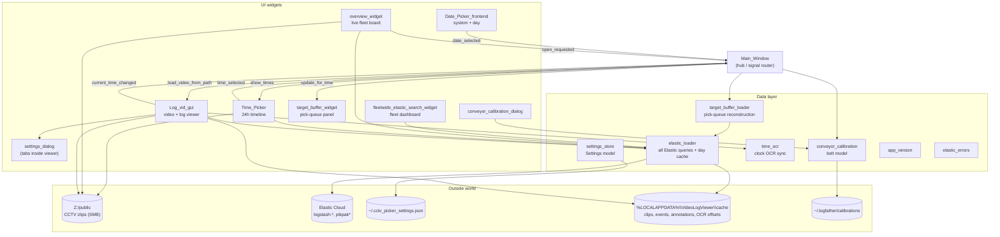

# The Logfather — architecture

A PySide6/OpenCV desktop app that plays CCTV clips of Leap robots side-by-side with
their Elastic logs, frame-aligned by OCR-reading the burned-in video clock.
This document is generated from a deep read of the code (2026-09-02, commit lineage
starts at the colleague's drop). The in-app About page shows a condensed version.

## The big picture

`Main_Window.py` is the hub: it builds every panel and routes signals between them.
Pick a system+day in the **date picker** → the **timeline** loads that day's clips and
Elastic event marks → click a clip → the **viewer** plays it with logs alongside →
as the playhead moves, the **targets panel** and conveyor overlays follow. Two
alternate full-screen modes swap in via a stacked widget: the live **Overview** board
and the **Fleetwide Search** dashboard. All Elastic access funnels through
`elastic_loader.py`; all persistent state through `settings_store.py`.

Three standalone scripts sit outside the app: `elastic-log-download.py` (CLI CSV
export via Kibana Reporting), `Vid_Frame_Differencing.py` (motion-analysis prototype
whose maths was copied into the viewer), and `logs_to_srt.py` (legacy CSV→subtitles).

## What each file does

| File | Lines | Purpose |
|---|---|---|
| `Main_Window.py` | ~2,000 | The application shell: builds the window, hosts every panel, and routes signals between them. Also owns the Stop Report, the conveyor overlays, and the pick-buffer background loading. |
| `Log_vid_gui.py` | ~6,700 | The heart of the app: plays a CCTV clip side-by-side with the robot's Elastic logs, kept frame-aligned via OCR clock sync. Also: drawing/measuring annotations, a synced second camera, frame-diff/optical-flow analysis, and export of clips with overlays burned in. |
| `Time_Picker.py` | ~1,600 | The 24-hour timeline strip: each clip is a block, with coloured marks for Elastic events and SKU runs, a live playhead, rate heat strips, and click-to-open. |
| `Date_Picker_frontend.py` | ~500 | The left panel: system buttons grouped by customer with logos, plus a calendar highlighting days that actually have footage. |
| `overview_widget.py` | ~1,500 | The live "control room" board: one row per robot showing today's SKU runs, manual periods, stops and CCTV coverage, auto-refreshing every minute. Clicking a row jumps the viewer to that system and moment. |
| `fleetwide_elastic_search_widget.py` | ~800 | The fleet dashboard: run saved Elastic searches across every system over 1–90 days, with per-robot counts and stacked bar charts split into "during operation" vs "startup/stopped". |
| `elastic_loader.py` | ~2,300 | The single gateway to Elastic: builds and paginates every query (day events, raw logs, overview chunks, fleetwide histograms), caches past days forever and today for 2 minutes, and handles both robot-ID conventions (`leap_robot_id` / `system_id`). |
| `elastic_errors.py` | 10 | One exception class that lets a partly-failed Elastic query still deliver the rows it managed to fetch. |
| `settings_store.py` | ~400 | Everything the app remembers — video root, Elastic key, the 15 condition queries, customers/lines/logos, fleetwide searches — saved as `~/.cctv_picker_settings.json`. |
| `settings_dialog.py` | ~500 | The Settings UI: connection details, condition rows, and the customer/system layout tables. Embedded as tabs inside the viewer's right panel. |
| `target_buffer_loader.py` | ~300 | Replays "new pick target" log messages (with a 60-min lookback) to reconstruct the robot's pick queue at any instant of a clip. |
| `target_buffer_widget.py` | ~460 | The "Targets" side panel: an animated card per queued item, updating as the video plays, with tight/wide-gap highlighting. |
| `target_scope_widget.py` | ~220 | A small "radar" window drawing recent pick targets in camera space. Currently dormant — the app never opens it. |
| `conveyor_calibration.py` | ~350 | The belt model: stores per-robot calibrations (`~/.logfather/calibrations/`) so queued targets can be drawn moving along the conveyor in the video. Only the two-click line method is live; an older homography path is unused. |
| `conveyor_calibration_dialog.py` | ~330 | The calibration wizard: click the same belt landmark on two frames a few seconds apart and it derives the on-screen belt velocity. |
| `time_ocr.py` | ~1,700 | The clock reader: OCRs the burned-in CCTV timestamp (Tesseract) to pin each clip's true start to the frame — automatic scan plus an interactive ROI-tuning tool. |
| `app_version.py` | 45 | Reports which build is running by reading `version.json` (stamped by `build.ps1` with version + git SHA); falls back to "dev". |
| `Vid_Frame_Differencing.py` | ~690 | Standalone motion-analysis prototype (frame differencing + optical flow). Its five analysis functions were copied into the viewer; kept as a reference. |
| `logs_to_srt.py` | ~160 | Legacy one-shot script: CSV log export → `.srt` subtitles. Superseded by live in-app alignment. |
| `elastic-log-download.py` | ~300 | Standalone CLI that asks Kibana's Reporting API for a CSV of logs for a robot/time range. API key comes from `LOGFATHER_ELASTIC_API_KEY` only. |
| `build.ps1` + `*.spec` + `*.iss` | — | Release pipeline: stamp `version.json`, PyInstaller-bundle "The Logfather" (optionally with Tesseract inside), then Inno Setup installer. |
| `about_page.py` | — | The About dialog: version linked to its GitHub commit, the architecture diagram, and these file summaries. |
| `tools/`, `tests/` | — | Smoke test (imports + offscreen window build), pytest unit tests for the parsing logic, live Elastic API check. |

## Key flows

**Open a clip (the hot path).** DatePicker `date_selected` → MainWindow →
`TimePicker.show_times` (worker thread: list clips from filenames, then Elastic
condition/SKU items appended as they arrive) → user clicks a block →
`time_selected` → `viewer.load_video_from_path` (copies the clip from `Z:` to the
local cache first, then OpenCV) → viewer fetches logs for the clip window in a
background thread → OCR sync fixes the sub-second start time → logs highlight in
step with playback.

**Time alignment.** Three offsets stack: filename time (`YYYYMMDDHHMMSS`, local) +
OCR correction (fraction of a second + frame nudge, cached per clip) + the user's
manual drift trim. `effective_offset()` in the viewer combines them; clicking a log
line inverts the maths to seek the video.

**Playhead fan-out.** Every displayed frame emits `current_time_changed` →
timeline playhead, targets-panel refresh (`buffer_state_at` via bisect), and
conveyor overlay repaint (belt position from calibration age).

**Overview.** One worker thread scans every system's clips for today and streams
Elastic transition events for **all robots at once** in 10-minute chunks; a
per-system state machine turns raw events into SKU/manual bands and stop ticks.
Incremental refresh every 60 s; full resync every 30 min.

**Fleetwide search.** Per system (4-way parallel): one paginated query for
occurrences (30 s per-search dedup cooldown), one for operation-state transitions,
one for the state just before the window — then each occurrence is classified
"operating" if ≥60 s after `start_pnp` with no stop between.

## External state (everything outside the repo)

| Location | Contents |
|---|---|
| `~/.cctv_picker_settings.json` | All settings incl. Elastic API key. The repo's `cctv_picker_settings.json` is a colleague export the app never reads. |
| `%LOCALAPPDATA%\VideoLogViewer\cache` | Local clip copies (30 GB / 30-day LRU), Elastic day caches, per-clip annotation JSON, OCR offset cache. |
| `~/.logfather/calibrations/` | One JSON per robot: conveyor belt calibration. |
| `Z:/public/PikPak<NNN>/YYYY/MM/DD/*.mp4` | The CCTV footage (IONOS HiDrive share; colleague maps it as `Y:`). |
| Elastic Cloud | Index pattern `logstash-*,pikpak,pikpak-*`; Kibana URL in settings is rewritten `.kb.` → `.es.` for queries. |

## Known dead code (as imported, 2026-09-02)

Confirmed unreachable by the analysis pass — candidates for cleanup, left alone for now:
`TargetScopeWidget` (never instantiated), `Main_Window._export_timeline_clip_range` /
`_recheck_ocr_offset` / `_find_horizontal_splitter`, `Time_Picker`'s own clip-range
context-menu/drag handlers and its `clip_range_export_requested` signal (the viewer's
signal of the same name is the live one), `DatePicker.settings_requested`,
`elastic_loader.fetch_target_rate_histogram` / `fetch_overview_events` /
`_logs_cache_path`, the homography path in `conveyor_calibration`
(`CalPoint`, `compute_homography`, `project`, `project_rect`), and
`target_buffer_widget._ClearBanner`. `Vid_Frame_Differencing.py` and
`logs_to_srt.py` are standalone leftovers kept as reference.
